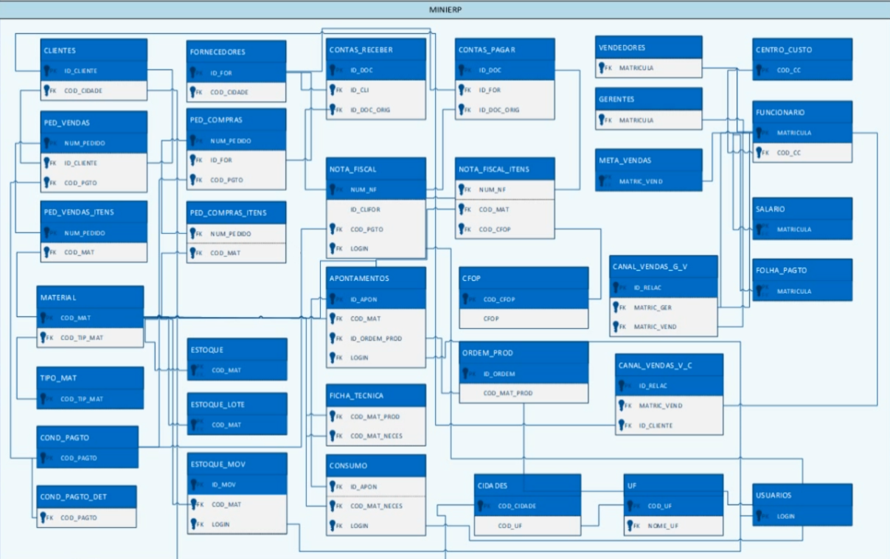

# Sql_ERP
Criação da estrutura de tabelas dentro do banco de dados para o projeto de MINIERP utilizando SQLSERVER

### Segue abaixo o diagrama da da arquitetura do banco de dados:

- caso queira olhar em maior qualidade acesse o arquivo /minierp/MINIERP_OFC.vsdx

